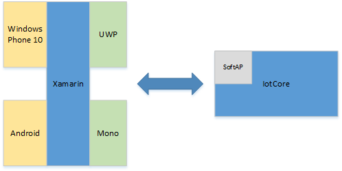
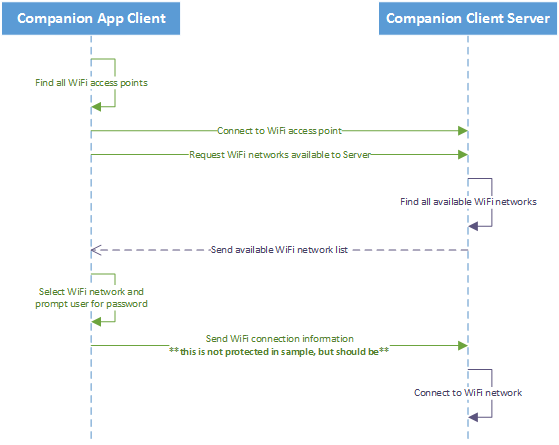

Windows 10 IoT Core sample code
===============

[Documentation for this sample](https://developer.microsoft.com/en-us/windows/iot/samples/companionapp) 

## How to download:

Unfortunately, GitHub does not support downloading individual code. 

Navigate to [ms-iot/samples](https://github.com/ms-iot/samples) and select **Clone or download** to download the whole repository.

### Requirements

+ Visual Studio 2015 Update 3
+ Xamarin for Visual Studio
    + Xamarin   4.2.0.719 (15694b9)
    + Xamarin.Android   7.0.1.6 (5a02b03)
+ Update Xamarin Nuget to v2.3.3.168

### Design

This sample is intended to show how to remotely configure an IotCore device when it is not attached to a network.  

There are two parts to this:

1. Client - running on an Android or Windows Phone 10 phone, this app will find your IotCore device, connect to it, and allow you to specify the required information to join a WiFi network. 
1. Server - running on your IotCore device, this app (foreground or background) help the Client connect your IotCore device to a desired WiFi network. 

The client utilizes Xamarin Forms to create a UI app for Android and Windows Phone 10 devices.  


The general communication flow between Client and Server 


### Usage

1. Download this sample.
1. Connect to your IotCore device using the [Device Portal](https://developer.microsoft.com/en-us/windows/iot/docs/deviceportal), open the Onboarding page, and set the SoftAP settings SSID to be something recognizable.
1. Connect to your IotCore device using [SSH](https://developer.microsoft.com/en-us/windows/iot/docs/ssh) or [PowerShell](https://developer.microsoft.com/en-us/windows/iot/docs/powershell) and run the following commands to enable SoftAP

    ```
    reg add hklm\system\currentcontrolset\services\mpssvc\parameters /v IoTInboundLoopbackPolicy /t REG_DWORD /d 1
    checknetisolation loopbackexempt -a -n=IoTOnboardingTask-uwp_1w720vyc4ccym
    checknetisolation loopbackexempt -a -n=CompanionAppServer_1w720vyc4ccym
    ```
1. Restart your device.
1. Open **CompanionAppServer\CompanionAppServer.sln**, select the appropriate startup project, platform and use F5 to build, deploy, and launch.
    + `CompanionAppServer` is a Background Application
1. Connect Android phone or Windows Phone 10 to computer.
1. Open **CompanionAppClient\CompanionAppClient.sln**, select the appropriate startup project, platform and use F5 to build, deploy, and launch.
    + `CompanionAppClient.Droid` and Any CPU for Android
    + `CompanionAppClient.UWP` and ARM for Windows Phone 10
1. On your phone, follow the flow:
    1. Click the `Scan for Access Points` button
    1. Select your IotCore device's access point and click the `Connect to Access Point` button
    1. Click the `Get Networks` button
    1. Select the desired network, enter the network's password, and click the `Connect` button
1. At this point, your IotCore device should be connected to your desired WiFi network. 

## Additional resources
* [Windows 10 IoT Core home page](https://developer.microsoft.com/en-us/windows/iot/)
* [Documentation for all samples](https://developer.microsoft.com/en-us/windows/iot/samples)

This project has adopted the Microsoft Open Source Code of Conduct. For more information see the Code of Conduct FAQ or contact opencode@microsoft.com with any additional questions or comments.
