Windows 10 IoT Core sample code
===============

## About this sample
If you want to create a solution that builds the foreground application and the background application into the same .APPX file it will require manual steps to combine the two projects.

### Steps

1. File>New>Project…
2. Create a new Blank App

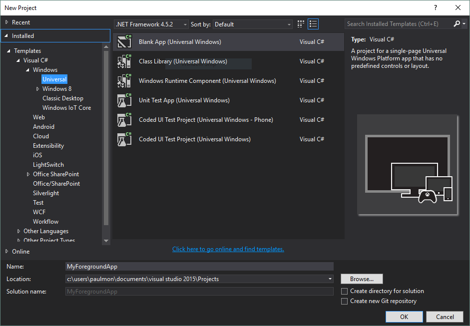

3. Select desired target version and click OK when prompted for target version

4.	In Solution Explorer right-click on the solution and choose Add>New Project …

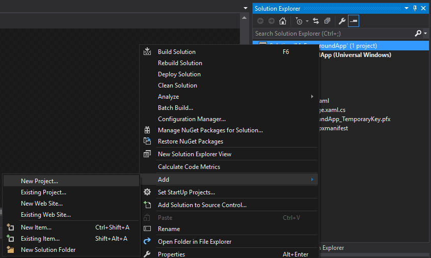

5.	Create a new Background Application

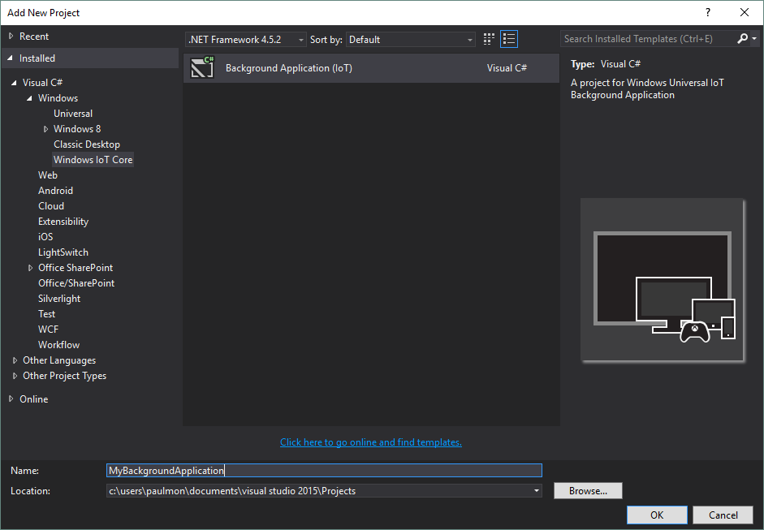

6.	Select desired target version and click OK when prompted for target version

7.	In Solution Explorer right-click on the background application Package.appxmanifest and choose View Code

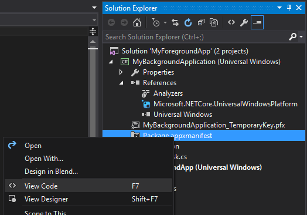

8.	In Solution Explorer right-click on the foreground application Package.appxmanifest and choose View Code

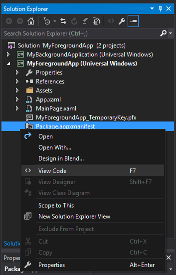

9.	At the top of the foreground Package.appxmanifest add xmlns:iot="http://schemas.microsoft.com/appx/manifest/iot/windows10" and modify IgnorableNamespaces to include iot.

        <Package
        xmlns="http://schemas.microsoft.com/appx/manifest/foundation/windows10"
        xmlns:mp="http://schemas.microsoft.com/appx/2014/phone/manifest"
        xmlns:uap="http://schemas.microsoft.com/appx/manifest/uap/windows10"
        xmlns:iot="http://schemas.microsoft.com/appx/manifest/iot/windows10"
        IgnorableNamespaces="uap mp iot">

10.	Copy the <Extensions> from the Background Application project Package.appxmanifest  to the Foreground Application Package.appxmanifest.  It should look like this:

        <Applications>
        <Application Id="App"
            Executable="$targetnametoken$.exe"
            EntryPoint="MyForegroundApp.App">
            <uap:VisualElements
            DisplayName="MyForegroundApp"
            Square150x150Logo="Assets\Square150x150Logo.png"
            Square44x44Logo="Assets\Square44x44Logo.png"
            Description="MyForegroundApp"
            BackgroundColor="transparent">
            <uap:DefaultTile Wide310x150Logo="Assets\Wide310x150Logo.png"/>
            <uap:SplashScreen Image="Assets\SplashScreen.png" />
            </uap:VisualElements>
            <Extensions>
            <Extension Category="windows.backgroundTasks" EntryPoint="MyBackgroundApplication.StartupTask">
                <BackgroundTasks>
                <iot:Task Type="startup" />
                </BackgroundTasks>
            </Extension>
            </Extensions>
        </Application>
        </Applications>

11.	In Solution Explorer right-click on the Foreground Application References node and choose Add Reference…

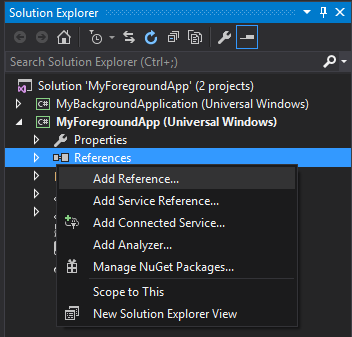

12.	Add a project reference to the Background Application
 
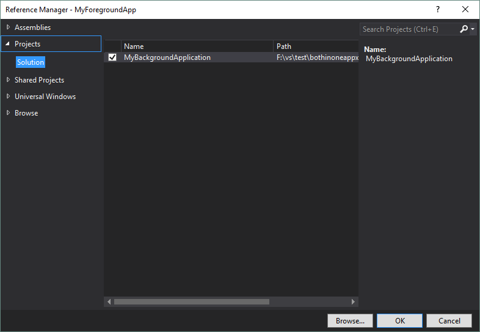

13.	In Solution Explorer right-click the foreground application project and choose Unload Project, then right-click the background application project and choose Unload Project.

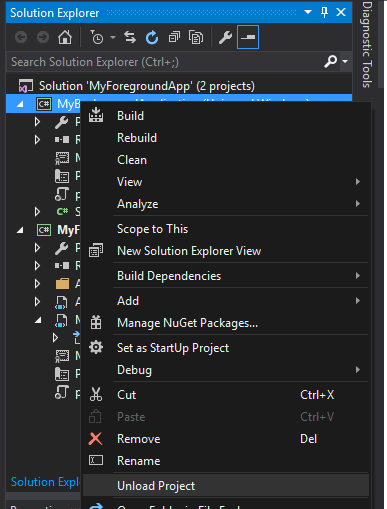

14.	In Solution Explorer right-click on the foreground application project and choose Edit MyForegroundApp.csproj and then right-click on the background application project and choose Edit MyBackgroundApp.csproj.
 
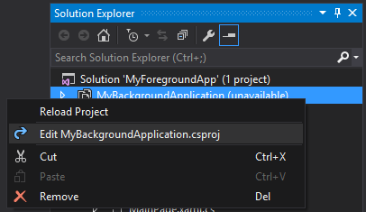

15.	In the background project file comment the following lines:

        <!--<PackageCertificateKeyFile>MyBackgroundApplication_TemporaryKey.pfx</PackageCertificateKeyFile>-->
        <!--<AppxPackage>true</AppxPackage>-->
        <!--<ContainsStartupTask>true</ContainsStartupTask>-->

16.	In the foreground project file add <ContainsStartupTask>true</ ContainsStartupTask> to the first PropertyGroup

        <PropertyGroup>
            <!-- snip -->
            <PackageCertificateKeyFile>MyForegroundApp_TemporaryKey.pfx</PackageCertificateKeyFile>
            <ContainsStartupTask>true</ContainsStartupTask>
        </PropertyGroup>

17.	In Solution Explorer right-click on each project and choose Reload Project

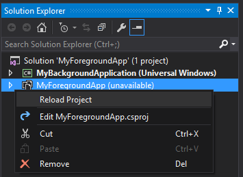

18.	In Solution Explorer delete Package.appxmanifest from the background application

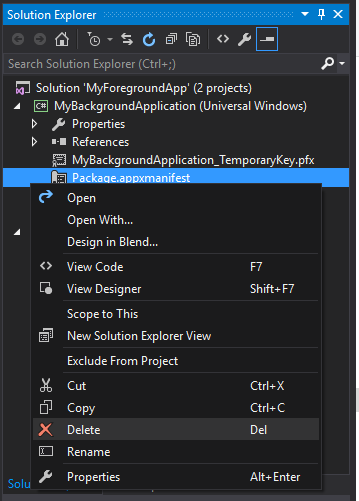

19.	At this point the project should build (and run the implementation you have added to the foreground and background applications).

## How to download:

Unfortunately, GitHub does not support downloading individual code.

Navigate to [ms-iot/samples](https://github.com/ms-iot/samples) and select **Clone or download** to download the whole repository.

## Additional resources
* [Windows 10 IoT Core home page](https://developer.microsoft.com/en-us/windows/iot/)
* [Documentation for all samples](https://developer.microsoft.com/en-us/windows/iot/samples)

This project has adopted the Microsoft Open Source Code of Conduct. For more information see the Code of Conduct FAQ or contact opencode@microsoft.com with any additional questions or comments.