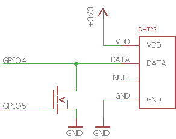

Windows 10 IoT Core sample code
===============

[Documentation for this sample](https://developer.microsoft.com/en-us/windows/iot/samples/gpioonewire)

| Minimum SDK Version | 15063 |
|---------------------|-------|
| Minimum OS Version  | 15063 |

This sample has been updated to use the `GpioChangeReader` API which is
new as of build 15063. You must install SDK version 15063 or later to build
this sample.

The sample has been temporarily modified to use two pins instead of one to
drive the DHT22. `GpioChangeReader` requires interrupts to be
enabled. `GpioPin.SetDriveMode()` currently takes
much longer when interrupts are enabled than when they are
disabled. If you try to change a pin from output to input when interrupts
are enabled, you will miss the response from the DHT22.
As a workaround, two pins are used to interface with the DHT22.
One pin is configured as an output and is used to assert the data line LOW
to request a sample. The other pin is configured as input and is used to
capture changes on the data line.

Your breadboard should be wired as follows. You can use either a MOSFET or
BJT transistor. If you use a BJT, be sure to put a resistor in series with the
base of the transistor.

## How to download:

Unfortunately, GitHub does not support downloading individual code.

Navigate to [ms-iot/samples](https://github.com/ms-iot/samples) and select **Clone or download** to download the whole repository.

## Additional resources
* [Windows 10 IoT Core home page](https://developer.microsoft.com/en-us/windows/iot/)
* [Documentation for all samples](https://developer.microsoft.com/en-us/windows/iot/samples)

This project has adopted the Microsoft Open Source Code of Conduct. For more information see the Code of Conduct FAQ or contact opencode@microsoft.com with any additional questions or comments.