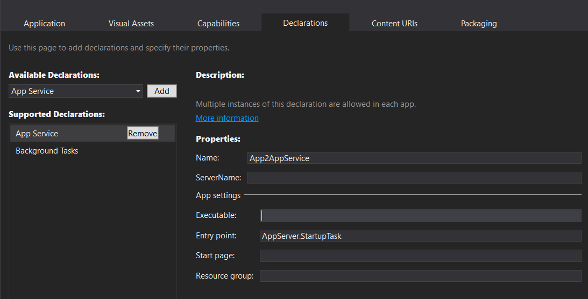

## Python App Service Sample



When writing a Python app for Windows 10 IoT Core you may find yourself trying to use a class available in the UWP namespace only to
realize that the UWP namespace is not accessible. Although you cannot call UWP functions directly from Python, you still can take advantage 
of UWP functions. Windows 10 introduced new ways for applications to communicate with each other. One of those ways is to implement 
"App Services." App Services is a request/response model where one app can call a service located within another app. 
App Services enables communication between apps, but also with the system. 

### Set up your PC
* Follow the instructions [here]({{site.baseurl}}/{{page.lang}}/GetStarted.htm) to setup your device and PC.

* Install Python for Windows (3.*) from [http://www.python.org/downloads](http://www.python.org/downloads){:target="_blank"}

* Download and install PTVS (Python Tools for Visual Studio) **VS 2015** latest release from [here](https://github.com/microsoft/ptvs/releases){:target="_blank"}.

* Download and install the latest Python UWP SDK (pyuwpsdk.vsix) release from [here](https://github.com/ms-iot/python/releases){:target="_blank"}.

### Headless mode

This application is designed for a headless device.  To better understand what Headless mode is and how to configure your device to be headless, follow the instructions [here]({{site.baseurl}}/{{page.lang}}/win10/HeadlessMode.htm).

### Load the project in Visual Studio

You can find the source code for this sample by downloading a zip of all of our samples [here](https://github.com/ms-iot/samples/archive/develop.zip) and navigating to the `samples-develop\PythonApp2App`.  Make a copy of the folder on your disk and open the project from Visual Studio.

If you're building for MinnowBoard Max, select `x86` in the architecture drop down.  If you're building for Raspberry Pi 2 or 3, select `ARM`.

### Let's look at the code
The code for this sample is pretty simple. We use AppService from WinRT.ApplicationModel and time modules.

### App Client
The first step in setting up our sample is importing the AppService class from our WinRT.ApplicationModel namespace.
In addtion we'll establish two global variables:

	from WinRT.ApplicationModel import AppService
	import time

	greetingsReceived = False
	serviceClosed = False


Now we will want to establish our event handlers. OnServiceClosed handles a closed event and OnRequestReceived handles a receive event from the server
The OnRequestReceived method processes incoming messages from the AppService Server and responds with a "Thank you" message

def OnServiceClosed(connection, eventArgs):
	print("OnServiceClosed() -", eventArgs.Status)
	global serviceClosed
	serviceClosed = True
    
def OnRequestReceived(connection, eventArgs):
	deferral = eventArgs.GetDeferral()
	print("OnRequestReceived()")
	print("Message:", eventArgs.Reqest.Message)
	print("Sending response...")
	status = eventArgs.Request.SendResponse({"Greetings":"Thank you"})
	print("Response status:", status)
	global greetingsReceived
	greetingsReceived = True
	deferral.Complete()


We proceed to write our our main class and helper function PrintMessage

def PrintMessage(dict)
	for k, v in sorted(dict.items()):
		print('\t', k, '\t', v)

def main():
<!-- hidden code -->

main()


Here we'll create the connection, assign the event handlers, and open the connection to our server
You will need to know the 'AppServiceName' of your AppService server and the 'PackageFamilyName' of your AppService server
_This can be found in the Package.appxmainfest file_


def main():
	with AppService.AppServiceConnection() as conn:
		conn.ServiceClosed.Add(OnServiceClosed)
		conn.RequestReceived.Add(OnRequestReceived)

		conn.AppServiceName = "App2AppService"
		conn.PackageFamilyName = "AppServer-uwp_y3yrc27jh5z9e"

		print("Opening...")
		status = conn.Open()
		print("Open status:", status)
		while(not greetingsReceived):
			time.sleep(1)

		while(not serviceClosed):
			time.sleep(1)


Okay, let's start sending and receiving some messages from the server.

		<!-- hidden code
			while(not greetingsReceived):
			time.sleep(1)
		-->
		print()
		print("Send test message...")
		response = conn.SendMessage({"Action":"TestValue"})
		print("Status:", respond.Status)
		print("Message:")
		PrintMessage(respond.Message)
		testValues = respond.Message

		print()
		print("Send echo message...")
		response = conn.SendMessage({"Action":"Echo", "String":"this should be echo'ed back"})
		print("Status:", respond.Status)
		print("Message:")
		PrintMessage(respond.Message)

		print()
		print("Send echo test value message...")
		testValues["Action"] = "Echo"
		response = conn.SendMessage(testValues)
		print("Status:", respond.Status)
		print("Message:")
		PrintMessage(respond.Message)

		<!-- hidden code 
			while(not serviceClosed):
			time.sleep(1)
		-->


Finally we send a disconnct message to end the session

print()
print("Send disconnct message...")
respond = conn.SendMessage({"Action":"Disconnect"})
print("Status:", respond.Status)
print("Message:", respond.Message)

while (not serviceClosed):
	time.sleep(1)


Our client is complete. Let's build the server next. Start by creating a new C# Background Task (Universal Windows) project.
In our Run method we establish the appService

var appService = taskInstance.TriggerDetails as AppServiceTriggerDetails;

if (appService != null)
            {
                if (appService.Name.Equals("AppServer-uwp"))
                {
                    appService.AppServiceConnection.RequestReceived += AppServiceConnection_RequestReceived;

                    var message = new ValueSet();
                    message["Greetings"] = appService.CallerPackageFamilyName;
                    appService.AppServiceConnection.SendMessageAsync(message).AsTask().Wait();
                }
                else
                {
                    deferral.Complete();
                }
            }


And finally we will declare our RequestReceived event. 

private async void AppServiceConnection_RequestReceived(AppServiceConnection sender, AppServiceRequestReceivedEventArgs args)
        {
            var messageDefferal = args.GetDeferral();
            var message = args.Request.Message;

            var testValues = new ValueSet()
            {
                { "Null", null},

                { "BoolMin", false },
                { "BoolMax", true },

                { "CharMin", System.Char.MinValue},
                { "CharMax", System.Char.MaxValue},

                { "ByteMin", System.Byte.MinValue },
                { "ByteMax", System.Byte.MaxValue },

                { "Int16Min", System.Int16.MinValue},
                { "Int16Max", System.Int16.MaxValue},
                { "Int32Min", System.Int32.MinValue},
                { "Int32Max", System.Int32.MaxValue},
                { "Int64Min", System.Int64.MinValue},
                { "Int64Max", System.Int64.MaxValue},

                { "UInt16Min", System.UInt16.MinValue},
                { "UInt16Max", System.UInt16.MaxValue},
                { "UInt32Min", System.UInt32.MinValue},
                { "UInt32Max", System.UInt32.MaxValue},
                //{ "UInt64Min", System.UInt64.MinValue},
                //{ "UInt64Max", System.UInt64.MaxValue},

                { "SingleMin", System.Single.MinValue},
                { "SingleMax", System.Single.MaxValue},
                { "DoubleMin", System.Double.MinValue},
                { "DoubleMax", System.Double.MaxValue},

                { "StringNull", null},
                { "StringEmpty", String.Empty},
                { "String", "string"},

                { "Array<bool>", new System.Boolean[] {false, true } },

                { "Array<Char>", new System.Char[] {System.Char.MinValue, System.Char.MaxValue } },
                { "Array<byte>", new System.Byte[] {System.Byte.MinValue, System.Byte.MaxValue } },

                { "Array<Int16>", new System.Int16[] { System.Int16.MinValue, System.Int16.MaxValue } },
                { "Array<Int32>", new System.Int32[] { System.Int32.MinValue, System.Int32.MaxValue } },
                { "Array<Int64>", new System.Int64[] { System.Int64.MinValue, System.Int64.MaxValue } },

                { "Array<UInt16>", new System.UInt16[] { System.UInt16.MinValue, System.UInt16.MaxValue } },
                { "Array<UInt32>", new System.UInt32[] { System.UInt32.MinValue, System.UInt32.MaxValue } },
                //{ "Array<UInt64>", new System.UInt64[] { System.UInt64.MinValue, System.UInt64.MaxValue } },

                { "Array<Single>", new System.Single[] { System.Single.MinValue, System.Single.MaxValue } },
                { "Array<Double>", new System.Double[] { System.Double.MinValue, System.Double.MaxValue } },

                { "Array<String>", new System.String[] {String.Empty, "string", "foobar"} },
            };

            object action;
            if (message.TryGetValue("Action", out action))
            {
                var str = action as string;
                if (String.Compare(str, "TestValues") == 0)
                {
                    await args.Request.SendResponseAsync(testValues);
                }
                else if (String.Compare(str, "Echo") == 0)
                {
                    await args.Request.SendResponseAsync(message);
                }
                else if (String.Compare(str, "Disconnect") == 0)
                {
                    Windows.UI.Xaml.Application.Current.Exit();
                }
            }

            messageDefferal.Complete();
        }

###Deploy and Run Sample

To get the Python App 2 App Sample running, first deploy the AppServer project. This will register the app-to-app communication mechanism. Then deploy and run the AppClient project.

* Follow the instructions to [setup remote debugging and deploy the app]({{site.baseurl}}/{{page.lang}}/win10/AppDeployment.htm#python).

	**NOTE: For now, use device name in lieu of IP address.  If the device name is not unique, use `setcomputername` tool on the device to reset the device name and reboot.  Documentation for this can be found [here]({{site.baseurl}}/{{page.lang}}/win10/samples/PowerShell.htm)**

* The Python app will deploy and start on the device.

	**NOTE: Launching the debugger for Python can take a few minutes to connect and start debugging the remote Python.  If it takes more than a few minutes, there may be a problem with msvsmon on the remote device.  Please check the FAQ for any potential fixes/workarounds.**

### Questions/Suggestions

Please refer to the [FAQ]({{site.baseurl}}/{{page.lang}}/Faqs.htm) for issues.

